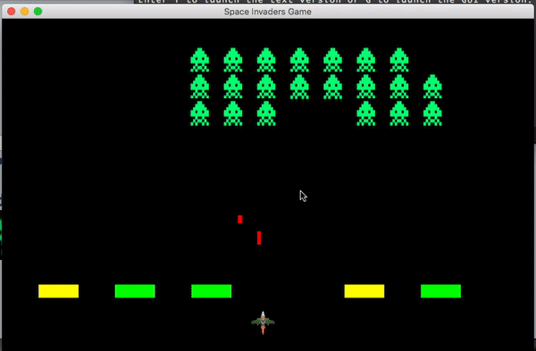

Space Invaders Java version by Team Unlucky 13 :)

Authors:
Fytopoulou, Panagiota
Ma, Celina
Qureshi, Safian Omar
Virk, Simratdeep
Zurnaxhiu, Besim

I. File List
_________________________

Image/sound files (in main)
----------------------------
a.png
destroy.wav
kill.wav
ship.wav
shoot.wav
shot.wav

Package: control
----------------

InvadersGameController.java
InvadersGameController$1.class
InvadersGameController.class

RunMe.java
RunMe$1.class
RunMe.class

Scores.java
Scores.class

Package: model
---------------

InvadersGameLogic.java                Drawable.java
InvadersGameLogic.class               Drawable.class

Alien.java                            AlienArray.java
Alien.class                           AlienArray.class

Barrier.java                          Shot.java
Barrier.class                         Shot.class

PlayerShip.java                       Shape.java
PlayerShip.class                      Shape.class

BarrierArray.java
BarrierArray.class

Test Files: AlienTest.java
            AlienArrayTest.java
            PlayerShipTest.java
            ShotTest.java

	    hamcrest-core-1.3.jar
	    junit-4.12.jar

Package: view
---------------

InvadersGameGUI.java
InvadersGameGUI$1.class
InvadersGameGUI$Canvas.class
InvadersGameGUI.class

InvadersGameText.java
InvadersGameText.class

II.Design & Issues
_______________________
     
	 The game is designed to run both a text version in the Command Prompt, as well as a GUI version in a new window. Both versions are controlled by the InvadersGameController and the logic of the game is handled by InvadersGameLogic. 
	 Reducing code duplication and simplifying the code, inheritance is used in the Shape class which is extended by the Alien, Shot, PlayerShip and Barrier classes, which are the main entities in the game.
	 When chosing the TEXT version of the game, the code is redirected to run InvadersGameText as well as print the game board and all its components.
	 When chosing the GUI version of the game, the code is redirected to run InvadersGameGUI, which implements the canvas and creates a new window to play the game in. Shape implements the class Drawable. 
	 
	 Issues that arose during the creation of the game from beginning to present are the alien array creation and hit detection. 
	Alien array movement was complicated as many variables had to be taken into account and the program threw out of bounds errors as the alien array moved close to the border of the game board. 
	Added functionality such as, when the outmost alien columns are destroyed, the entire array moves closer to the boundaries and is not just fixed, caused errors in the text version, but these were fixed. 
	Hit detection was one of the greatest issues as it had to take all the objects into account. For now we have split up the detection into Gui and text version.
        Errors which did not crash the game, such as Aliens not being drawn/printed in the space expected were fixed right away. 

Privacy Leaks
--------------
	This game relies on the InvadersGameLogic class to hold instances of the other key logic classes (AlienArray, Shot, PlayerShip,
	BarrierArray). These instances are passed to the controller class and used to update the text board or GUI window, depending on 
	the version run. Constants such as boardHeight/Width and screenHeight/Width are immutable. Privacy leaks for the Shape classes 
	(Shot, PlayerShip...) are avoided by using copy constructors, so that InvadersGameLogic only returns copies of each object.
	This prevents modification of their state by outside classes while allowing InvadersGameText and InvadersGameGUI to correctly
	display each object.
	
III. Imports
___________________
	
	import java.awt.Graphics;
	import java.awt.Color;
	import java.awt.Component;
	import java.util.Scanner;
	import java.util.ArrayList;
	import java.util.Collections;
	import javax.swing.Timer;
	import java.awt.event.KeyEvent;
	import java.awt.event.KeyListener;
	import java.awt.event.ActionListener;
	import java.awt.event.ActionEvent;
	import java.awt.Font;
	import java.io.File;
	import java.io.IOException;
	import java.awt.Dimension;
	import javax.swing.JComponent;
	import javax.swing.JFrame;
	
	
IV. Playing The Game
________________________

	How to compile the game:
	
	1. From the Command Prompt, enter the "main" folder.
	2. Compile each package using the following commands:
	
		javac control/*.java
		javac view/*.java
		
	3. Compile the model package (which contains tests) by moving into the model folder and using the following command
	   (replace ":" with ";" if using Windows). Ensure the files hamcrest-core-1.3.jar and junit-4.12.jar are present.
	   
		javac -cp .:junit-4.12.jar:hamcrest-core-1.3.jar *.java
		
	Follow the instructions to play the game:
	
	1. From the Command Prompt, enter the main folder and use the following command:
	   
		java -cp . control.RunMe
		
	2. Select the version, T for the Text version, G for the GUI version.
	3. Play the game, good luck!
	
	Controls:
	
	Left = A
	Right = D
	Fire = F (Text) or Space (GUI)
	
	Destroy the aliens to win! If they reach the bottom or hit you with their bullets, it's game over!
	
V.  Testing
________________________

	Automated tests are included in the model package. See section IV for compiling the test files.

	Running automated tests:
	
	1. From the Command Prompt, enter the "main" folder. Ensure the files hamcrest-core-1.3.jar and junit-4.12.jar are present.

	2. Enter the following command, replacing <Test Class> with the name of the test class to run (eg. ShotTest). Replace
	   all ":" with ";" if using Windows.
	   
	   java -cp .:junit-4.12.jar:hamcrest-core-1.3.jar org.junit.runner.JUnitCore model.<Test Class>
	   
	Testing the graphical user interface:
	
	1. Pressing 'A' and 'D' will move the ship left and right. The ship should not be able to go out of bounds.
	
	2. Pressing 'Space' will fire a shot. Only one shot should fire at a time. 
	   When the shot passes through a barrier, the barrier should change colour or be destroyed.
	   When the shot passes through an alien, it should be destroyed.
	   
	3. When the ship is hit by an alien shot, the game over screen should display.
	4. If the aliens get near the bottom of the screen, a game over results.
	5. If all aliens are destroyed, the time elapsed and the top 10 high scores should be shown.
	
	
--------------------------------------------
Fin	

Previous output progress can be viewed in output folder. Most recent output is below:

In 'V12', barriers change representation based on the amount of hits taken.

In 'V15', gif images are used of aliens are added along with sound effects. The screen is also extended with more aliens added so that it feels like an actual game.
