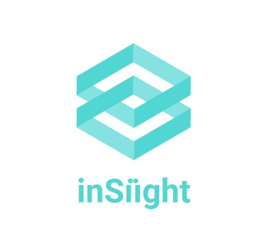

# InSiight

Transforming professor-student feedback interactions for a better educational experience.

## Getting Started

1. Please install [Node.js LTS](https://nodejs.org/en/).

2. Clone this repository.

3. Install project dependencies
```
npm install
```

4. Start a development server

```
npm start
```

You should see your website at https://localhost:5000. Any time you save your changes to your files, it will automatically be reloaded on the server. This is called "hot reloading".

5. Start a development AWS Lambda functions server
```
npm start:lambda
```

AWS Lambda functions development server is at https://localhost:9000/{function-name}

6. Create a production build
```
npm run build
```

7. Preview the production build
```
npm run preview
```

## Directory Structure
```
.
├── .gitignore                # Tells git which files or folders to ignore
├── dist                      # Folder where the build script places the built app. Use this in prod.
├── docs                      # Documentation on development
├── functions                 # Built AWS Lambda functions for Netlify from ./src/functions
├── node_modules              # Folder where 3rd party libraries and dependencies are installed to
├── src                       # Source code
│   ├── assets                # Image and font assets
│   ├── components            # Reusable, shareable, HTML component partials
│   ├── functions             # AWS Lambda functions for Netlify source files
│   ├── pages                 # Pages that exist in the website, with sub folders being the page names
│   ├── styles                # CSS styles, written in Sass
│   ├── utils                 # Helper functions or utility functions (client-side JS)
│   └── index.js              # Main Entry point for the website's home page
├── index.html                # Main HTML file for home page
├── package.json              # Package configuration. The list of 3rd party libraries and utilities
├── package-lock.json         # Package configuration version lock (ensures consistency of 3rd party libraries)
├── postcss.config.js         # PostCSS is a tool for transforming styles with JS plugins.
├── webpack.config.dev.js     # Configures webpack for development builds
└── webpack.config.prod.js    # Configures webpack for production builds
```

## How To's

* [Create a new page](./docs/CreateNewPage.md)
* [Use Netlify functions](./src/functions/README.md)
* [Using MongoDB](./src/functions/README.md#MongoDB)
* [Database Schema](./src/functions/README.md#Database-Schema)
* [Database Secrets/Authentication](./src/functions/README.md#Database-Secrets)

## Contributors 

Developers
- Jackie Luc - [GitHub](https://github.com/jackieluc)
- Logan Pearce - [GitHub](https://github.com/ljpearce)
- Omar Qureshi - [GitHub](https://github.com/q-omar)

Business 
- Michael Vereb
- Ioana Rontu

## Credits 

This project uses [webpack-starter-basic](https://github.com/lifenautjoe/webpack-starter-basic).
